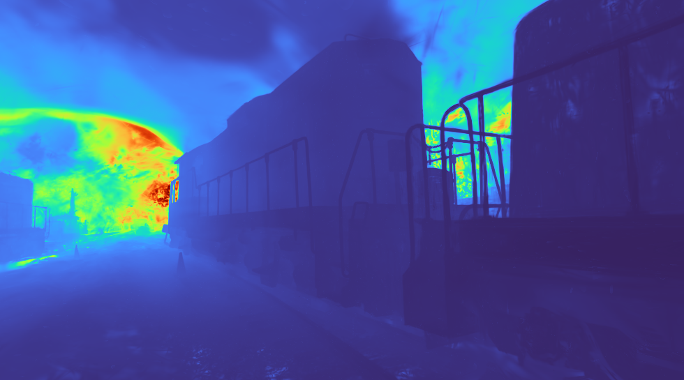
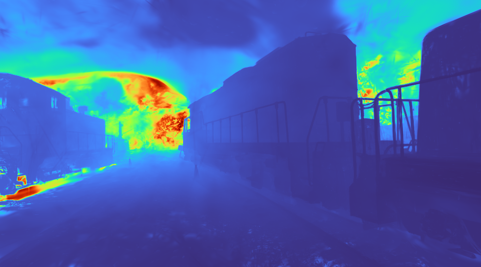
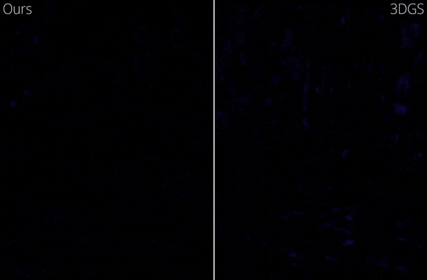

# StopThePop
## Sorted Gaussian Splatting for View-Consistent Real-time Rendering
[Lukas Radl](https://r4dl.github.io/)<sup>&#42;</sup>, 
[Michael Steiner](https://scholar.google.com/citations?hl=de&user=Pbtgcz8AAAAJ)<sup>&#42;</sup>,
[Mathias Parger](https://dabeschte.github.io/), 
[Alexander Weinrauch](https://scholar.google.com/citations?user=pkqf2mgAAAAJ&hl=de&oi=ao), 
[Bernhard Kerbl](https://snosixtyboo.github.io/), 
[Markus Steinberger](https://www.markussteinberger.net/)
<br> 
<sup>&#42;</sup> denotes equal contribution
<br>
| [Webpage](https://r4dl.github.io/StopThePop) 
| [Full Paper](https://arxiv.org/abs/2402.00525) 
| [Video](https://youtu.be/EmcXtHYhigk) 
| [T&T+DB COLMAP (650MB)](https://repo-sam.inria.fr/fungraph/3d-gaussian-splatting/datasets/input/tandt_db.zip) 
| [Pre-trained Models (18.13 GB)](https://drive.google.com/file/d/1uk49LWsVjapLokTNHbTBMS8hMi3MuNDj/view?usp=sharing) 
<br>


This repository contains the official authors implementation associated with the paper "StopThePop: Sorted Gaussian Splatting for View-Consistent Real-time Rendering", which can be found [here](https://r4dl.github.io/StopThePop). 
<!-- We further provide the reference images used to create the error metrics reported in the paper, as well as recently created, pre-trained models.  -->

<a href="https://www.tugraz.at/en/home"> </a>

<a href="https://www.tuwien.at/en/"> </a>

Abstract: *Gaussian Splatting has emerged as a prominent model for constructing 3D representations from images across diverse domains. However, the efficiency of the 3D Gaussian Splatting rendering pipeline relies on several simplifications. Notably, reducing Gaussian to 2D splats with a single view-space depth introduces popping and blending artifacts during view rotation. Addressing this issue requires accurate per-pixel depth computation, yet a full per-pixel sort proves excessively costly compared to a global sort operation. In this paper, we present a novel hierarchical rasterization approach that systematically resorts and culls splats with minimal processing overhead. Our software rasterizer <b>effectively eliminates popping artifacts and view inconsistencies</b>, as demonstrated through both quantitative and qualitative measurements. Simultaneously, our method mitigates the potential for cheating view-dependent effects with popping, ensuring a more authentic representation. Despite the elimination of cheating, our approach achieves comparable quantitative results for test images, while increasing the consistency for novel view synthesis in motion. Due to its design, our hierarchical approach is <b>only 4% slower</b> on average than the original Gaussian Splatting. Notably, enforcing consistency enables a reduction in the number of Gaussians by approximately half with nearly identical quality and view-consistency. Consequently, rendering performance is nearly doubled, making our approach 1.6x faster than the original Gaussian Splatting, with a 50% reduction in memory requirements.*


<section class="section" id="BibTeX">
  <div class="container is-max-desktop content">
    <h2 class="title">BibTeX</h2>
    <pre><code>@article{radl2024stopthepop,
  author    = {Radl, Lukas and Steiner, Michael and Parger, Mathias and Weinrauch, Alexander and Kerbl, Bernhard and Steinberger, Markus},
  title     = {{StopThePop: Sorted Gaussian Splatting for View-Consistent Real-time Rendering}},
  journal   = {ACM Transactions on Graphics},
  number    = {4},
  volume    = {43},
  articleno = {64},
  year      = {2024},
}</code></pre>
  </div>
</section>

## Overview
Our repository is built on [3D Gaussian Splatting](https://repo-sam.inria.fr/fungraph/3d-gaussian-splatting/):
For a full breakdown on how to get the code running, please consider [3DGS's Readme](https://github.com/graphdeco-inria/gaussian-splatting/blob/main/README.md).

The project is split into submodules, each maintained in a separate github repository:

* [StopThePop-Rasterization](https://github.com/r4dl/StopThePop-Rasterization): A clone of the original [diff-gaussian-rasterization](https://github.com/graphdeco-inria/diff-gaussian-rasterization) that contains our CUDA hierarchical rasterizer implementation
* [SIBR_StopThePop](https://github.com/r4dl/SIBR_StopThePop): A clone of the [SIBR Core](https://gitlab.inria.fr/sibr/sibr_core) project, containing an adapted viewer with our additional settings and functionalities
* [PoppingDetection](https://github.com/r4dl/PoppingDetection): A self-contained module for our proposed popping detection metric

## Licensing

The majority of the projects is licensed under the ["Gaussian-Splatting License"](LICENSE.md), with the exception of:

* [PoppingDetection](https://github.com/r4dl/PoppingDetection): MIT License
* [StopThePop header files](submodules/diff-gaussian-rasterization/cuda_rasterizer/stopthepop): MIT License
* [FLIP](utils/flip.py): BSD-3 license

There are also several changes in the original source code.
If you use any of our additional functionalities, please cite our paper and link to this repository.

## Cloning the Repository

The repository contains submodules, thus please check it out with 
```shell
# HTTPS
git clone https://github.com/r4dl/StopThePop --recursive
```

## Setup

### Local Setup

Our default, provided install method is based on Conda package and environment management:
```shell
SET DISTUTILS_USE_SDK=1 # Windows only
conda env create --file environment.yml
conda activate stopthepop
```
> **Note:** This process assumes that you have CUDA SDK **11** installed, not **12**.

### Running

The implementation includes 4 flavors of Gaussian Splatting:
<ul>
  <li>Ours: <strong>Hierarchically Sorted Rasterizer</strong> (recommended)</li>
  <li>Ours: Per-pixel Approximate Sort (k-Buffer)</li>
  <li>Ours: Per-pixel Full Sort (only forward pass supported; no optimization) </li>
  <li>Vanilla 3DGS</li>
</ul>

The `train.py` script takes a `.json` config file as the argument `--splatting_config`, which should contain the following information (this example is also the default `config.json`, if none is provided):

```cpp
{
  "sort_settings": 
  {
    "sort_mode": 0,    // Global (0), Per-Pixel Full (1), Per-Pixel K-Buffer (2), Hierarchical (3)
    "sort_order": 0,   /* Viewspace Z-Depth (0), Worldspace Distance (1), 
                          Per-Tile Depth at Tile Center (2), Per-Tile Depth at Max Contrib. Pos. (3) */
    "queue_sizes": 
    {
      "per_pixel": 4,  // Used for: Per-Pixel K-Buffer and Hierarchical
      "tile_2x2": 8,   // Used only for Hierarchical
      "tile_4x4": 64   // Used only for Hierarchical
    }
  },
  "culling_settings": 
  {
    "rect_bounding": false,            // Bound 2D Gaussians with a rectangle (instead of a square)
    "tight_opacity_bounding": false,   // Bound 2D Gaussians by considering their opacity value
    "tile_based_culling": false,       /* Cull Tiles where the max. contribution is below the alpha threshold;
                                          Recommended to be used together with Load Balancing*/
    "hierarchical_4x4_culling": false, // Used only for Hierarchical
  },
  "load_balancing": false,      // Use load balancing for per-tile calculations (culling, depth, and duplication)
  "proper_ewa_scaling": false,  /* Proper dilation of opacity, as proposed by Yu et al. ("Mip-Splatting");
                                   Model also needs to be trained with this setting */
}
```
These values can be overwritten through the command line. 
Call `python train.py --help` to see all available options.
At the start of training, the provided arguments will be written into the output directory.
The `render.py` script uses the `config.json` in the model directory per default, with the option to overwrite through the command line.

To train different example models (see the corresponding config files for the used settings), run:

```shell
# Our Hierarchical Rasterizer, as proposed in StopThePop
python train.py --splatting_config configs/hierarchical.json -s <path to COLMAP or NeRF Synthetic dataset>
# Vanilla 3DGS
python train.py --splatting_config configs/vanilla.json -s <path to COLMAP or NeRF Synthetic dataset>
# Per-Pixel K-Buffer Sort (Queue Size 16)
python train.py --splatting_config configs/kbuffer.json -s <path to COLMAP or NeRF Synthetic dataset>
```

<details>
<summary><span style="font-weight: bold;">Additional Command Line Arguments for train.py</span></summary>

  #### --opacity_decay
  Train with Opacity Decay - this results in comparable image metrics with significantly fewer Gaussians. We used  ```--opacity_decay 0.9995``` for the reported results in our paper.
  #### --splatting_config
  Full config to specify the flavor of Gaussian Splatting. See ```configs/``` for pre-defined configs.
  #### --sort_mode
  Specify Sort Mode - must be one of ```{GLOBAL,PPX_FULL,PPX_KBUFFER,HIER}```
  #### --sort_order 
  Specify Sort Order - must be one of ```{Z_DEPTH,DISTANCE,PTD_CENTER,PTD_MAX}```
  #### --tile_4x4     
  Specify size of 4x4 tile queue - only needed if using sort_mode ```HIER```, only ```64``` supported.
  #### --tile_2x2 
  Specify size of 2x2 tile queue - only needed if using sort_mode ```HIER```, only ```{8,12,20}``` supported.
  #### --per_pixel {1,2,4,8,12,16,20,24}
  Specify size of per-pixel queue: If using sort_mode ```HIER```, only ```{4,8,16}``` supported. If using sort_mode ```KBUFFER```, all values are supported.
  #### --rect_bounding 
  Bound 2D Gaussians with a rectangle instead of a circle - must be one of ```{True,False}```
  #### --tight_opacity_bounding 
  Bound 2D Gaussians by considering their opacity - must be one of ```{True,False}```
  #### --tile_based_culling 
  Cull complete tiles based on opacity - must be one of ```{True,False}``` (recommended with Load Balancing)
  #### --hierarchical_4x4_culling 
  Cull Gaussians for 4x4 subtiles - must be one of ```{True,False}```, only when using sort_mode ```HIER```
  #### --load_balancing {True,False}
  Perform per-tile computations cooperatively (e.g. duplication) -  must be one of ```{True,False}```
  #### --proper_ewa_scaling 
  Dilation of 2D Gaussians as proposed by Yu et al. ("Mip-Splatting") -  must be one of ```{True,False}```

</details>
<details>
  <summary><span style="font-weight: bold; opacity: 50%;">Original Command Line Arguments for train.py</span></summary>

  #### --source_path / -s
  Path to the source directory containing a COLMAP or Synthetic NeRF data set.
  #### --model_path / -m 
  Path where the trained model should be stored (```output/<random>``` by default).
  #### --images / -i
  Alternative subdirectory for COLMAP images (```images``` by default).
  #### --eval
  Add this flag to use a MipNeRF360-style training/test split for evaluation.
  #### --resolution / -r
  Specifies resolution of the loaded images before training. If provided ```1, 2, 4``` or ```8```, uses original, 1/2, 1/4 or 1/8 resolution, respectively. For all other values, rescales the width to the given number while maintaining image aspect. **If not set and input image width exceeds 1.6K pixels, inputs are automatically rescaled to this target.**
  #### --data_device
  Specifies where to put the source image data, ```cuda``` by default, recommended to use ```cpu``` if training on large/high-resolution dataset, will reduce VRAM consumption, but slightly slow down training. Thanks to [HrsPythonix](https://github.com/HrsPythonix).
  #### --white_background / -w
  Add this flag to use white background instead of black (default), e.g., for evaluation of NeRF Synthetic dataset.
  #### --sh_degree
  Order of spherical harmonics to be used (no larger than 3). ```3``` by default.
  #### --convert_SHs_python
  Flag to make pipeline compute forward and backward of SHs with PyTorch instead of ours.
  #### --compute_cov3D_python
  Flag to make pipeline compute forward and backward of the 3D covariance with PyTorch instead of ours.
  #### --debug
  Enables debug mode if you experience erros. If the rasterizer fails, a ```dump``` file is created that you may forward to us in an issue so we can take a look.
  #### --debug_from
  Debugging is **slow**. You may specify an iteration (starting from 0) after which the above debugging becomes active.
  #### --iterations
  Number of total iterations to train for, ```30_000``` by default.
  #### --ip
  IP to start GUI server on, ```127.0.0.1``` by default.
  #### --port 
  Port to use for GUI server, ```6009``` by default.
  #### --test_iterations
  Space-separated iterations at which the training script computes L1 and PSNR over test set, ```7000 30000``` by default.
  #### --save_iterations
  Space-separated iterations at which the training script saves the Gaussian model, ```7000 30000 <iterations>``` by default.
  #### --checkpoint_iterations
  Space-separated iterations at which to store a checkpoint for continuing later, saved in the model directory.
  #### --start_checkpoint
  Path to a saved checkpoint to continue training from.
  #### --quiet 
  Flag to omit any text written to standard out pipe. 
  #### --feature_lr
  Spherical harmonics features learning rate, ```0.0025``` by default.
  #### --opacity_lr
  Opacity learning rate, ```0.05``` by default.
  #### --scaling_lr
  Scaling learning rate, ```0.005``` by default.
  #### --rotation_lr
  Rotation learning rate, ```0.001``` by default.
  #### --position_lr_max_steps
  Number of steps (from 0) where position learning rate goes from ```initial``` to ```final```. ```30_000``` by default.
  #### --position_lr_init
  Initial 3D position learning rate, ```0.00016``` by default.
  #### --position_lr_final
  Final 3D position learning rate, ```0.0000016``` by default.
  #### --position_lr_delay_mult
  Position learning rate multiplier (cf. Plenoxels), ```0.01``` by default. 
  #### --densify_from_iter
  Iteration where densification starts, ```500``` by default. 
  #### --densify_until_iter
  Iteration where densification stops, ```15_000``` by default.
  #### --densify_grad_threshold
  Limit that decides if points should be densified based on 2D position gradient, ```0.0002``` by default.
  #### --densification_interval
  How frequently to densify, ```100``` (every 100 iterations) by default.
  #### --opacity_reset_interval
  How frequently to reset opacity, ```3_000``` by default. 
  #### --lambda_dssim
  Influence of SSIM on total loss from 0 to 1, ```0.2``` by default. 
  #### --percent_dense
  Percentage of scene extent (0--1) a point must exceed to be forcibly densified, ```0.01``` by default.
  </details>
<br>

### Evaluation

By default, the trained models use all available images in the dataset. 
To train them while withholding a test set for evaluation, use the ```--eval``` flag. 
This way, you can render training/test sets and produce error metrics as follows:

```shell
python train.py -s <path to COLMAP or NeRF Synthetic dataset> --eval # Train with train/test split
python render.py -m <path to trained model> # Generate renderings and gaussian count
python metrics.py -m <path to trained model> # Compute error metrics on renderings
```

Our repository additionally permits rendering of Depth, visualized with the *Turbo* colormap.
To render depth, run
```shell
python render.py -m <path to trained model> --render_depth
```

<a href="https://www.inria.fr/"> </a>
<a href="https://univ-cotedazur.eu/"> </a>

<details>
<summary><span style="font-weight: bold;">New Command Line Arguments for render.py</span></summary>

  #### --render_depth
  Flag to enable depth rendering.
  #### --skip_train
  Flag to skip rendering the training set.
  #### --skip_test
  Flag to skip rendering the test set.
</details>

<details>
<summary><span style="font-weight: bold; opacity: 50%;">Original Command Line Arguments for render.py</span></summary>

  #### --model_path / -m 
  Path to the trained model directory you want to create renderings for.
  #### --quiet 
  Flag to omit any text written to standard out pipe. 

  **The below parameters will be read automatically from the model path, based on what was used for training. However, you may override them by providing them explicitly on the command line.** 

  #### --source_path / -s
  Path to the source directory containing a COLMAP or Synthetic NeRF data set.
  #### --images / -i
  Alternative subdirectory for COLMAP images (```images``` by default).
  #### --eval
  Add this flag to use a MipNeRF360-style training/test split for evaluation.
  #### --resolution / -r
  Changes the resolution of the loaded images before training. If provided ```1, 2, 4``` or ```8```, uses original, 1/2, 1/4 or 1/8 resolution, respectively. For all other values, rescales the width to the given number while maintaining image aspect. ```1``` by default.
  #### --white_background / -w
  Add this flag to use white background instead of black (default), e.g., for evaluation of NeRF Synthetic dataset.
  #### --convert_SHs_python
  Flag to make pipeline render with computed SHs from PyTorch instead of ours.
  #### --compute_cov3D_python
  Flag to make pipeline render with computed 3D covariance from PyTorch instead of ours.
</details>

<details>
<summary><span style="font-weight: bold; opacity: 50%;">Original Command Line Arguments for metrics.py</span></summary>

  #### --model_paths / -m 
  Space-separated list of model paths for which metrics should be computed.
</details>
<br>

We further provide the ```full_eval.py``` script.
This script specifies the routine used in our evaluation and demonstrates the use of some additional parameters, e.g., ```--images (-i)``` to define alternative image directories within COLMAP data sets.
If you have downloaded and extracted all the training data, you can run it like this:

```shell
python full_eval.py -m360 <mipnerf360 folder> -tat <tanks and temples folder> -db <deep blending folder> --config <splatting config file>
```

#### Pre-Trained Models
If you want to evaluate our [pre-trained models](https://drive.google.com/file/d/1uk49LWsVjapLokTNHbTBMS8hMi3MuNDj/view?usp=sharing), you have to download the source datsets and indicate their location to ```render.py```, just as done here:
```shell
python render.py -m <path to pre-trained model> -s <path to COLMAP dataset>
```
Alternatively, you can modify the ```source_path``` with the ```cfg_args```-file and manually insert the correct path. 

> **Note:** We included our models for StopThePop and 3DGS, which were used in our evaluation: to minimize file size, we only include the final checkpoint. We also include the final, rendered images, hence you can reproduce our results easily.

<table>
  <tr>
  <td></td>
    <td colspan="4" style="text-align: center">Deep Blending</td>
    <td colspan="4" style="text-align: center">Mip-NeRF 360 Indoor</td>
    <td colspan="4" style="text-align: center">Mip-NeRF 360 Outdoor</td>
    <td colspan="4" style="text-align: center">Tanks & Temples</td>
  </tr>
  <tr>
    <td></td>
    <td>PSNR</td>
    <td>SSIM</td>
    <td>LPIPS</td>
    <td>&#xA7FB;LIP</td>
      <td>PSNR</td>
    <td>SSIM</td>
    <td>LPIPS</td>
    <td>&#xA7FB;LIP</td>
      <td>PSNR</td>
    <td>SSIM</td>
    <td>LPIPS</td>
    <td>&#xA7FB;LIP</td>
      <td>PSNR</td>
    <td>SSIM</td>
    <td>LPIPS</td>
    <td>&#xA7FB;LIP</td>
  </tr>
      <td>Ours</td>  
      <td>29.86</td> 
      <td>0.904</td> 
      <td>0.234</td>  
      <td>0.127</td>  
      <td>30.62</td>  
      <td>0.921</td>  
      <td>0.186</td>  
      <td>0.099</td>  
      <td>24.60</td>  
      <td>0.728</td>  
      <td>0.235</td>  
      <td>0.167</td>  
      <td>23.21</td>  
      <td>0.843</td>  
      <td>0.173</td>  
      <td>0.216</td> 
    <tr>
      <td>3DGS</td>  
      <td>29.46 </td>
      <td>0.900</td>
      <td>0.247 </td>
      <td>0.131 </td>
      <td>30.98 </td>
      <td>0.922 </td>
      <td>0.189 </td>
      <td>0.094 </td>
      <td>24.59 </td>
      <td>0.727 </td>
      <td>0.240 </td>
      <td>0.167 </td>
      <td>23.71 </td>
      <td>0.845 </td>
      <td>0.178 </td>
      <td>0.199</td>
    </tr>
</table>

[Download Results](https://drive.google.com/file/d/1uk49LWsVjapLokTNHbTBMS8hMi3MuNDj/view?usp=sharing)

<details>
<summary><span style="font-weight: bold;">New Command Line Arguments for full_eval.py</span></summary>
  
  #### --opacity_decay (float)
  Train with Opacity Decay - this results in comparable image metrics with significantly fewer Gaussians. We used  ```--opacity_decay 0.9995``` for the reported results in our paper.
</details>
<details>
<summary><span style="font-weight: bold; opacity: 50%;">Original Command Line Arguments for full_eval.py</span></summary>
  
  #### --skip_training
  Flag to skip training stage.
  #### --skip_rendering
  Flag to skip rendering stage.
  #### --skip_metrics
  Flag to skip metrics calculation stage.
  #### --output_path
  Directory to put renderings and results in, ```./eval``` by default, set to pre-trained model location if evaluating them.
  #### --mipnerf360 / -m360
  Path to MipNeRF360 source datasets, required if training or rendering.
  #### --tanksandtemples / -tat
  Path to Tanks&Temples source datasets, required if training or rendering.
  #### --deepblending / -db
  Path to Deep Blending source datasets, required if training or rendering.
</details>
<br>

## Performance

Our proposed optimization imply a significant performance improvement, even for vanilla 3DGS. 
Here is a framerate comparison for two exemplary scenes in Full HD resolution, run on an NVIDIA RTX 4090 with CUDA 11.8.

<table>
  <tr>
  <td></td>
  <td colspan="2" style="text-align: center">Bicycle</td>
  <td colspan="2" style="text-align: center">Train</td>
  </tr>
  <tr>
    <td></td>
    <td>3DGS</td>
    <td>Ours</td>    
    <td>3DGS</td>
    <td>Ours</td>
  </tr>
  <tr>
    <td>Vanilla</td>
    <td>90</td>
    <td>20</td>
    <td>159</td>
    <td>43</td>
  </tr>
  <tr>
    <td>w/ Rect Culling</td>
    <td>168</td>
    <td>42</td>
    <td>277</td>
    <td>81</td>
  </tr>
  <tr>
    <td>w/ Opacity Culling</td>
    <td>205</td>
    <td>54</td>
    <td>341</td>
    <td>97</td>
  </tr>
  <tr>
    <td>w/ Load Balancing</td>
    <td>216</td>
    <td>61</td>
    <td>360</td>
    <td>120</td>
  </tr>
  <tr>
    <td>w/ Tile-based Culling</td>
    <td>240</td>
    <td>76</td>
    <td>425</td>
    <td>145</td>
  </tr>
  <tr>
    <td>w/ 4x4 Tile Culling</td>
    <td>-</td>
    <td>119</td>
    <td>-</td>
    <td>213</td>
  </tr>
</table>

> **Note:** For 3DGS, 4x4 Tile Culling is not an option.

## Interactive Viewers
Following 3DGS, we provide interactive viewers for our method: remote and real-time. 
Our viewing solutions are based on the [SIBR](https://sibr.gitlabpages.inria.fr/) framework, developed by the GRAPHDECO group for several novel-view synthesis projects.
Our modified viewer contains additional debug modes, and options to disable several of our proposed optmizations.
The settings on startup are based on the `config.json` file in the model directory (if it exists).
The implementation is hosted [here](https://github.com/r4dl/SIBR_StopThePop).
Hardware requirements and setup steps are identical to 3DGS, hence, refer to the [corresponding README](https://github.com/graphdeco-inria/gaussian-splatting/blob/main/README.md) for details.

### Quick Setup: Installation from Source
If you cloned with submodules (e.g., using ```--recursive```), the source code for the viewers is found in ```SIBR_viewers```.

#### Windows
CMake should take care of your dependencies.
```shell
cd SIBR_viewers
cmake -Bbuild .
cmake --build build --target install --config RelWithDebInfo
```
You may specify a different configuration, e.g. ```Debug``` if you need more control during development.

#### Ubuntu 22.04
You will need to install a few dependencies before running the project setup.
```shell
# Dependencies
sudo apt install -y libglew-dev libassimp-dev libboost-all-dev libgtk-3-dev libopencv-dev libglfw3-dev libavdevice-dev libavcodec-dev libeigen3-dev libxxf86vm-dev libembree-dev
# Project setup
cd SIBR_viewers
cmake -Bbuild . -DCMAKE_BUILD_TYPE=Release # add -G Ninja to build faster
cmake --build build -j24 --target install
``` 

#### STOPTHEPOP_FASTBUILD
For performance reasons, we use templates for several of our options, causing very long compile times for our submodule and SIBR.
Hence, we provide a ```STOPTHEPOP_FASTBUILD``` option in [```rasterizer.h```](submodules/diff-gaussian-rasterization/cuda_rasterizer/rasterizer.h).
Simply uncomment 
```cpp
// #define STOPTHEPOP_FASTBUILD
``` 
This solely compiles the default options for our method, which should be sufficient.
If you further want to reduce the compile time, simply specify the exact ```CUDA_ARCHITECTURE``` in the [```CMakeLists.txt```](submodules/diff-gaussian-rasterization/CMakeLists.txt).
For ```SIBR```, the corresponding ```CMakeLists.txt``` is located in [```SIBR_viewers/extlibs/CudaRasterizer/CudaRasterizer/CMakeLists.txt```](SIBR_viewers/extlibs/CudaRasterizer/CudaRasterizer/CMakeLists.txt).

## Running the Real-Time Viewer
https://github.com/r4dl/StopThePop/assets/45897040/5e763600-c0d9-4055-b664-0b9ea342a248

<video width="99%" controls>
  <source src="assets/real-time-viewer-demo.mp4" type="video/mp4">
</video>


<section class="section" id="BibTeX">
  <div class="container is-max-desktop content">
    <h3 class="title">BibTeX</h2>
    <pre><code>@misc{sibr2020,
   author       = {Bonopera, Sebastien and Esnault, Jerome and Prakash, Siddhant and Rodriguez, Simon and Thonat, Theo and Benadel, Mehdi and Chaurasia, Gaurav and Philip, Julien and Drettakis, George},
   title        = {sibr: A System for Image Based Rendering},
   year         = {2020},
   url          = {https://gitlab.inria.fr/sibr/sibr_core}
}</code></pre>
  </div>
</section>

## Popping Detection
Our popping detection method is a self-contained module, hosted [here](https://github.com/r4dl/PoppingDetection), and is included as a submodule.<br>
For more information on how to run the method, consult the [submodules README](popping_detection/README.md).



## FAQ
Please consider 3DGS's FAQ, contained in [their README](https://github.com/graphdeco-inria/gaussian-splatting/blob/main/README.md). In addition, several issues are also covered on [3DGS's issues page](https://github.com/graphdeco-inria/gaussian-splatting/issues).
We will update this FAQ as issues arise.
